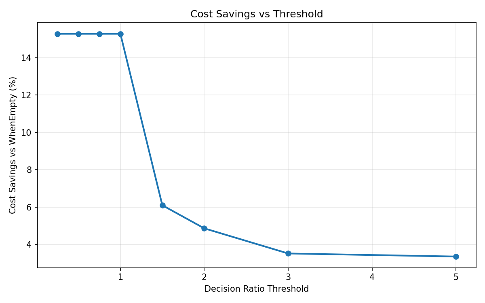
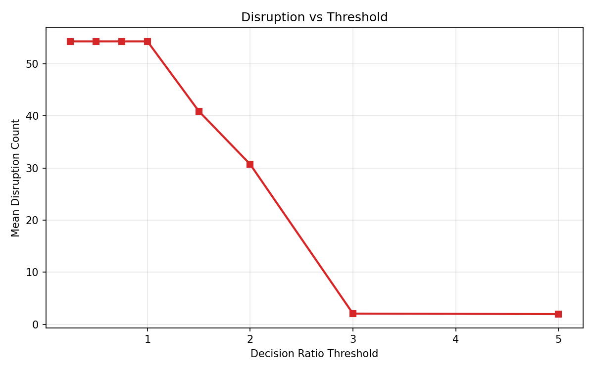
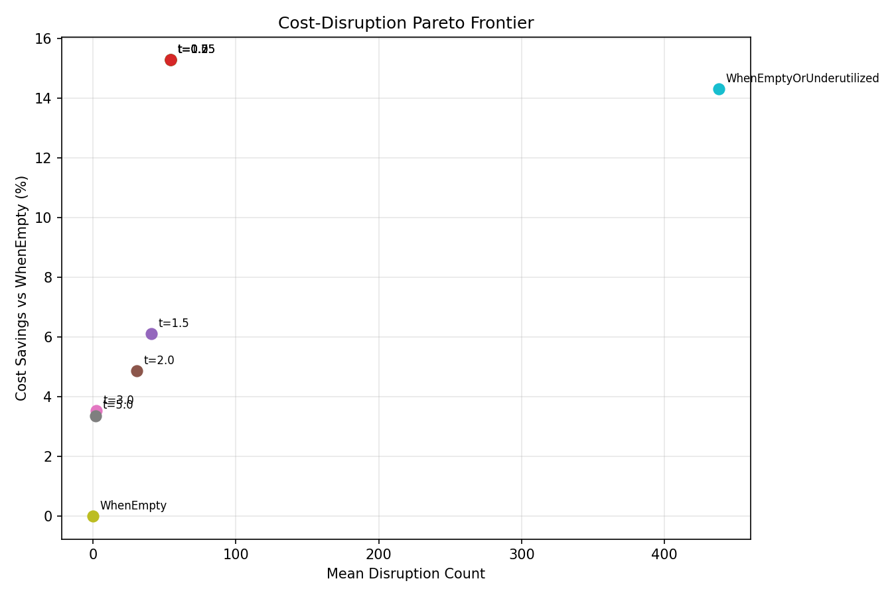
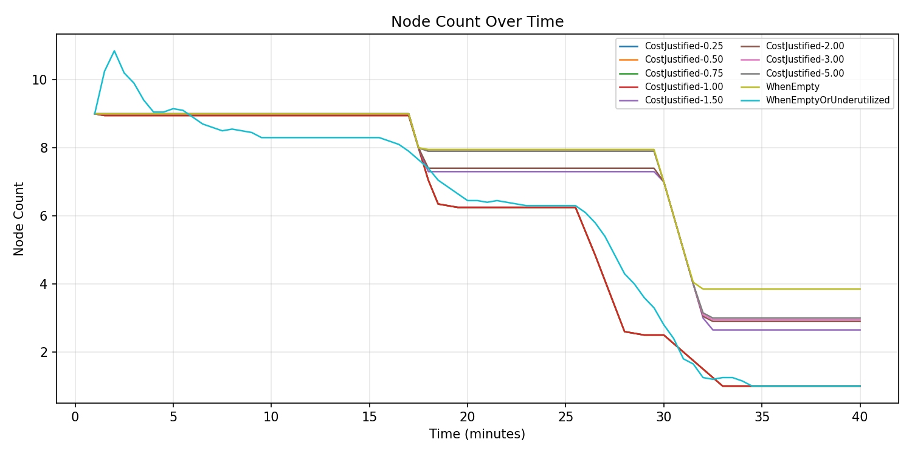
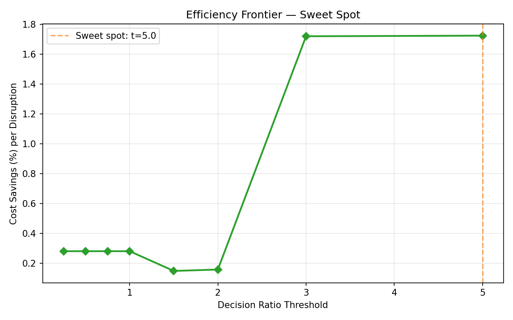

# ConsolidateWhen Tradeoff Analysis: benchmark-control-kwok

Variants: 10  
Runs per variant: 20

## Summary Table

| Variant | Cumulative Cost | Cost Savings (%) | Disruptions | Nodes (TWA) |
|---------|----------------|-------------------|-------------|-------------|
| CostJustified-0.25 | 13.30 | +15.27% | 54.3 | 13608.0 |
| CostJustified-0.50 | 13.30 | +15.27% | 54.3 | 13608.0 |
| CostJustified-0.75 | 13.30 | +15.27% | 54.3 | 13608.0 |
| CostJustified-1.00 | 13.30 | +15.27% | 54.3 | 13608.0 |
| CostJustified-1.50 | 14.74 | +6.10% | 40.9 | 16253.2 |
| CostJustified-2.00 | 14.94 | +4.87% | 30.7 | 16443.0 |
| CostJustified-3.00 | 15.15 | +3.52% | 2.0 | 16827.8 |
| CostJustified-5.00 | 15.18 | +3.36% | 1.9 | 16852.5 |
| WhenEmpty | 15.70 | +0.00% | 0.0 | 17306.2 |
| WhenEmptyOrUnderutilized | 13.46 | +14.30% | 438.2 | 13777.5 |

## Sweet Spot

Best cost-savings-per-disruption at threshold **5.0** (efficiency: 1.72% savings per disruption).

## Plots

