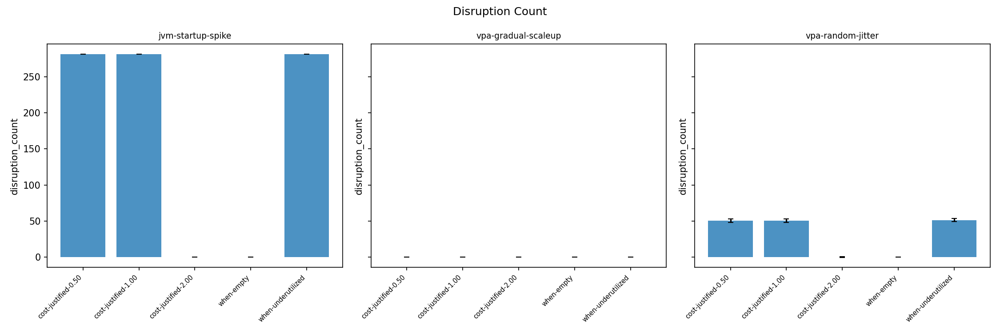
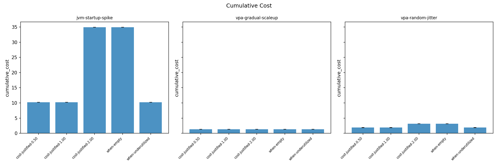
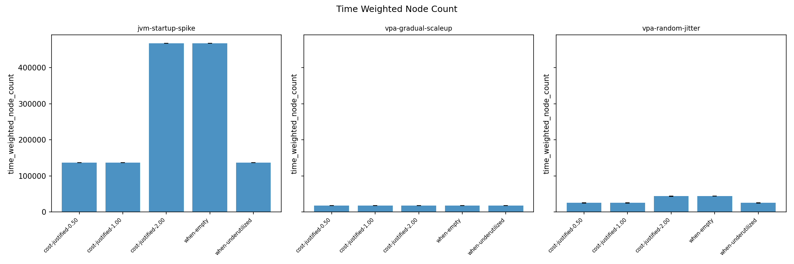
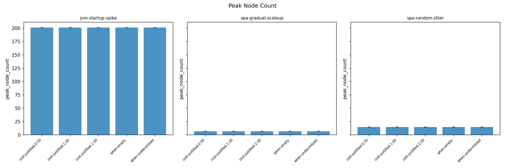
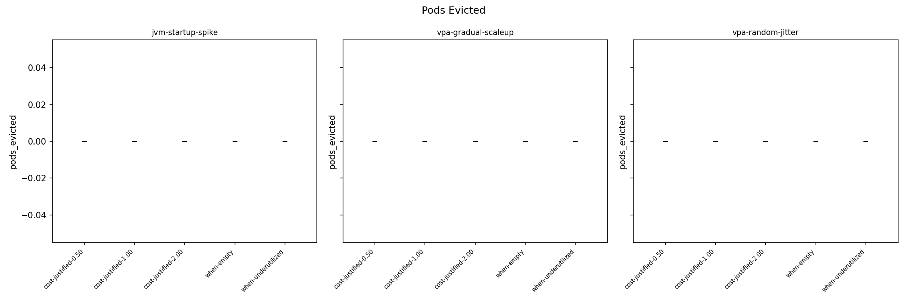
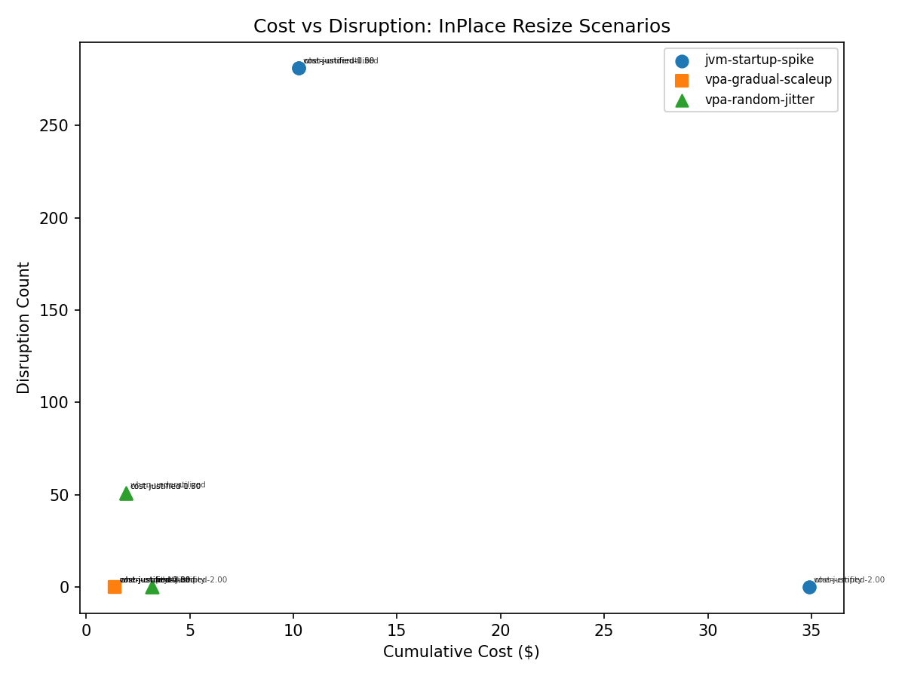

# InPlacePodVerticalScaling + Consolidation Analysis

Key question from karpenter#829: *How do we keep consolidation from causing
too much disruption and cancelling out the potential savings?*

## jvm-startup-spike

| Variant | disruption count | cumulative cost | time weighted node count | peak node count | pods evicted |
|---|---|---|---|---|---|
| cost-justified-0.50 | 281.00 ± 0.00 | 10.24 ± 0.00 | 137250.00 ± 0.00 | 201.00 ± 0.00 | 0.00 ± 0.00 |
| cost-justified-1.00 | 281.00 ± 0.00 | 10.24 ± 0.00 | 137250.00 ± 0.00 | 201.00 ± 0.00 | 0.00 ± 0.00 |
| cost-justified-2.00 | 0.00 ± 0.00 | 34.88 ± 0.00 | 467340.00 ± 0.00 | 201.00 ± 0.00 | 0.00 ± 0.00 |
| when-empty | 0.00 ± 0.00 | 34.88 ± 0.00 | 467340.00 ± 0.00 | 201.00 ± 0.00 | 0.00 ± 0.00 |
| when-underutilized | 281.00 ± 0.00 | 10.24 ± 0.00 | 137250.00 ± 0.00 | 201.00 ± 0.00 | 0.00 ± 0.00 |

## vpa-gradual-scaleup

| Variant | disruption count | cumulative cost | time weighted node count | peak node count | pods evicted |
|---|---|---|---|---|---|
| cost-justified-0.50 | 0.00 ± 0.00 | 1.38 ± 0.00 | 18480.00 ± 0.00 | 7.00 ± 0.00 | 0.00 ± 0.00 |
| cost-justified-1.00 | 0.00 ± 0.00 | 1.38 ± 0.00 | 18480.00 ± 0.00 | 7.00 ± 0.00 | 0.00 ± 0.00 |
| cost-justified-2.00 | 0.00 ± 0.00 | 1.38 ± 0.00 | 18480.00 ± 0.00 | 7.00 ± 0.00 | 0.00 ± 0.00 |
| when-empty | 0.00 ± 0.00 | 1.38 ± 0.00 | 18480.00 ± 0.00 | 7.00 ± 0.00 | 0.00 ± 0.00 |
| when-underutilized | 0.00 ± 0.00 | 1.38 ± 0.00 | 18480.00 ± 0.00 | 7.00 ± 0.00 | 0.00 ± 0.00 |

## vpa-random-jitter

| Variant | disruption count | cumulative cost | time weighted node count | peak node count | pods evicted |
|---|---|---|---|---|---|
| cost-justified-0.50 | 50.60 ± 2.46 | 1.91 ± 0.04 | 25691.25 ± 478.49 | 15.00 ± 0.00 | 0.00 ± 0.00 |
| cost-justified-1.00 | 50.60 ± 2.46 | 1.91 ± 0.04 | 25691.25 ± 478.49 | 15.00 ± 0.00 | 0.00 ± 0.00 |
| cost-justified-2.00 | 0.10 ± 0.44 | 3.18 ± 0.02 | 43959.75 ± 611.34 | 15.00 ± 0.00 | 0.00 ± 0.00 |
| when-empty | 0.00 ± 0.00 | 3.18 ± 0.00 | 44100.00 ± 0.00 | 15.00 ± 0.00 | 0.00 ± 0.00 |
| when-underutilized | 51.30 ± 2.28 | 1.91 ± 0.04 | 25772.25 ± 490.74 | 15.00 ± 0.00 | 0.00 ± 0.00 |

## Plots

